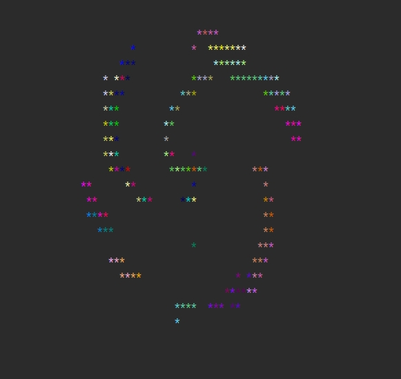
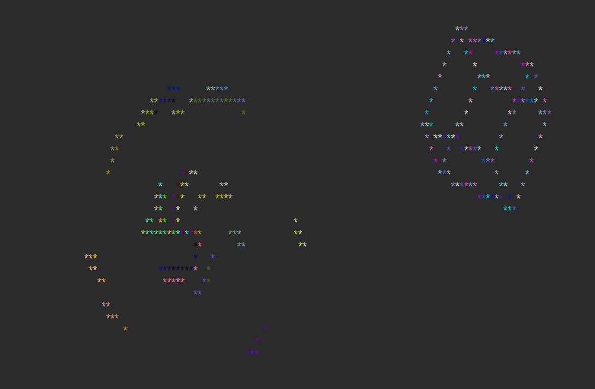

三维动画渲染

## 简介
&nbsp;&nbsp;&nbsp;&nbsp;本插件旨在使用php在控制台生成三3D动画，本插件仅适用于cli（命令行）模式。本项目已提供了立方体和金字塔模型的动画参数，
你可以使用demo进行测试。本插件工作原理：类似于现在的激光扫描，获取三维实物的外部轮廓的顶点，然后连接这些顶点，就可以构成三维事务的模型。在使用本
插件的时候，你只需要输入三维事物轮廓的顶点坐标，然后提供这些顶点坐标的连接路线（两点确定一条直线）,插件就可以绘制出对应的三维模型。如果你提供了
事务在三维坐标中的旋转角速度，那么本插件可以实现模型的旋转功能。如果你提供了三维事务在x轴和y轴上的偏移方向和速度，那么本插件生成的动画中，模型可以
实现上下左右移动。如果你提供了不同时刻的模型的顶点的坐标，可以实现模型形状的切换。本插件的用途暂时未知，因为没人会用php的cli模式来做动画。但是可以
接入用户输入和网络数据交互，从而实现类似于以前的网络动漫游戏。 所以，仅仅当做小玩具吧。

### 安装
```bash
composer require xiaosongshu/animation
```
### 使用实例

#### 旋转的立方体
```php 
<?php
require_once __DIR__ . '/src/Client.php';

$client = new \Xiaosongshu\Animation\Client();
/** 立方体 */
$config2 = [
    /** 初始三维倾斜度 */
    'angleX' => 0,
    'angleY' => 0,
    'angleZ' => 0,
    /** 三维角速度 */
    'angleStepX' => 0.01,
    'angleStepY' => 0.01,
    'angleStepZ' => 0.01,
    /** 缩放比例 */
    'scale' => 0,
    /** 初始二维偏移量 */
    'distanceX' => 0,
    'distanceY' => 0,
    /** 二维图像偏移步长 */
    'distanceXStep' => 1,
    'distanceYStep' => 1,
    /** 二维x轴正方向偏移 */
    'directionX' => -1,
    /** 二维y轴正方向偏移 */
    'directionY' => -1,
    /** 三维图案顶点坐标 : 更新三维物体的顶点坐标，可以实现模型的形状改变 */
    'vertices' => [
        /** 第一个动作 立方体由8个顶点构成 */
        [
            [-1, -1, -1],
            [1, -1, -1],
            [1, 1, -1],
            [-1, 1, -1],
            [-1, -1, 1],
            [1, -1, 1],
            [1, 1, 1],
            [-1, 1, 1]
        ],
        // ... 其他动作
    ],
    /** 三维图案绘图路径 两点构成一条直线边，一个立方体由12条边构成 */
    'edges' => [[0, 1], [1, 2], [2, 3], [3, 0], [4, 5], [5, 6], [6, 7], [7, 4], [0, 4], [1, 5], [2, 6], [3, 7]],
];
# 添加3D动画
$client->add3dAnimation($config2);
# 运行动画
$client->run();
```
#### 效果图


### 添加二维动画流星雨

#### 流星雨代码
```php 
<?php
require_once __DIR__ . '/src/Client.php';

$client = new \Xiaosongshu\Animation\Client();

/** 流星 */
$config3 = [
    'maxStars' => 10,
    'numStars' => 10,
    'isWaterLine' => true,
    /** 初始二维偏移量 */
    'distanceX' => 0,
    'distanceY' => 0,
    /** 二维图像偏移步长 */
    'distanceXStep' => 2,
    'distanceYStep' => 1,
    /** 二维x轴正方向偏移 */
    'directionX' => 0,
    /** 二维y轴正方向偏移 */
    'directionY' => 0,
];
# 添加2D动画
$client->addStarRain($config3);
# 运行动画
$client->run();
```
####  流星雨动画效果



### 动画叠加
本插件可以实现多个动画相互叠加，效果如下所示。
```php
<?php
require_once __DIR__ . '/src/Client.php';

$client = new \Xiaosongshu\Animation\Client();

# 添加3D动画
$client->add3dAnimation($config2);

# 添加2D动画
$client->addStarRain($config3);

# 运行动画
$client->run();
```

#### 


###  其它

后面再做其他特效吧，先这样了。